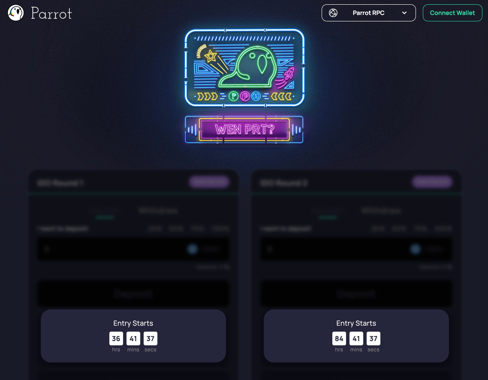

# Parrot IDO - Frontend

A modification of the [Mango Token Sale](https://github.com/blockworks-foundation/mango-token-sale) with some improvements.

- Support for multiple IDO pools
- Support for RPC selection
- Parrot UI components/styling

# Security

Review that mainnet addresses in [constants.ts](./src/config/constants.ts) match the [Parrot IDO mainnet addresses](https://doc.parrot.fi/security/mainnet.html#prt-ido).

# Serving The UI

The IDO UI is hosted at https://ido.parrot.fi/, but if you'd like to server your own UI, a pre-compiled static HTML site is available in `out`. You can use any static web server to serve that content.

For example, to use python's http server:

```
(cd out && python3 -m http.server 8899)
```

Then open http://localhost:8899, you should see the IDO UI:



# Development

To start the vue server:

```bash
yarn dev
```

To build for production:

```bash
yarn build
```

## Configuration

The configuration for the available RPCs and IDO pools are in [constants.ts](./src/config/constants.ts)

## Storybook

We use `storybook` to test the different states of the pool

```bash
yarn storybook:dev
```
